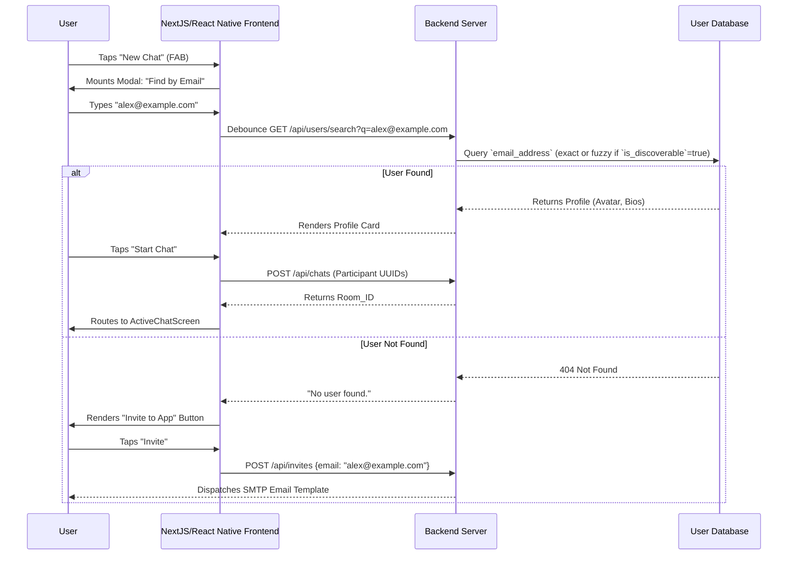

# 2026 WhatsApp Clone Blueprint (Email-Based Identity & Discovery)

This blueprint outlines the core logic, functional mappings, and architectural designs required to build a feature-complete messaging app. **It explicitly abandons the Phone Number/SIM-based identity model in favor of an Email-based constraint.**

## 1. Core Messaging Engine Logic & Storage

### Real-Time Protocol & State Machine
-   **WebSockets/XMPP**: Persistent TCP connections with Erlang-style lightweight concurrency.
-   **States**: `queue` (Clock) -> `sent` (Single Tick) -> `delivered` (Double Tick) -> `read` (Blue Tick).
-   **Storage**: Mnesia/Redis for routing; Encrypted SQLite for on-device persistence.

---

## 2. Identity & Discovery Logic (The "Find" Engine)

### Primary Key Redefinition
The entire system utilizes **Email Address (normalized/lowercase)** as the unique user identifier (`UID`), deprecating `phone_number`.

### Discovery Flow (Search-to-Chat Journey)
1. **Action**: User taps `New Chat` FAB.
2. **Redirect**: UI mounts the `Global Search Bar` ("Search by Email").
3. **Action**: User inputs email with real-time **debounce API searching**.
4. **Effect**: Database queries the `Users` table:
    *   **If Email Exists & Discoverable**: Render `Profile Card` containing Avatar and Bio.
    *   **If Email Does Not Exist**: Render an `Invite to App` button triggering an SMTP email template dispatch.
5. **Action**: User taps `Start Chat` on a Profile Card.
6. **Redirect**: Execute backend RPC to generate/fetch `Room_ID` where `User_A_Email` & `User_B_Email` are participants. Navigate immediately to `ActiveChatScreen`.

### Global Privacy Toggle
-   **`is_discoverable` (Boolean)**: If set to `false`, the user will intentionally skip wildcard index matching (e.g., stopping them from appearing in "People you may know"). Their profile will only resolve if the searching user enters the *exact, complete* email string.

---

## 3. Social Graph & Status Visibility (Relationship Logic)

Because there is no external OS-level Contact Book (SIM), the app constructs an internal Social Graph based on localized additions.

### Bidirectional "Contacts" Linking
-   **Definition**: A "Contact" is strictly defined as a foreign key linkage inside the internal database where User A actively saves User B's Email.

### Mutual Privacy for Status (Stories)
-   **Visibility Filter**: To view a Status/Story, **both** users must have explicitly saved each other's emails in their respective internal contact lists.
-   **Effect**:
    1. User A adds User B (A can't see B's status yet).
    2. User B adds User A.
    3. *Mutual Connection Established*.
    4. Action: Tap `Status` Tab.
    5. Effect: Query Engine resolves intersection. Display a horizontal list of 24h TTL stories specifically originating from the Mutual Connections array.

---

## 4. Account Creation & Verification Redirections

1. **Input**: User enters Email Address.
2. **Redirect**: System issues an HTTP request to an authentication provider (e.g., Supabase/Firebase Auth), dispatching a 6-digit OTP code or Magic Link via SMTP. User mounts the `VerificationScreen`.
3. **Effect**: Successful validation generates a unique `UUID` directly hard-linked to the normalized email. No SMS gateways are pinged.
4. **Device Linking**: Secondary devices (Desktop/Web) authenticate by scanning a localized QR Code or authorizing a push notification sent to the Primary Email Session.

---

## 5. Interaction Mappings & Subsystems

### A. Conversation Module
*   `SWIPE_LEFT_CHAT` → Reveal `Archive`, `Mute`.
*   `LONG_PRESS_MESSAGE` → Context actions `Forward`, `Delete`, `Star`.
*   `TAP_HEADER_USER` → Open `ContactProfileScreen`. Displays **Email Address** prominently under the username instead of a phone number.

### B. View Once & Voice Notes
*   **Media**: `is_ephemeral: true` forces local `delete()` on media viewer `onClose`.
*   **Voice**: Hold to record, slide up to lock, waveform rendering, playback speeds (1x-2x).

### C. VoIP & AI Engine
*   **Calls**: `CallOverlay` WebRTC projection (Audio/Video).
*   **AI**: Localized ML `Transcribe` button for Voice Notes. Meta-style AI FAB.

---

## 6. SQL Database Schema (Data Migration from Phone Model)

The schema removes integer-based phone columns in favor of heavily indexed VARCHAR email fields to support high-speed global lookups.

```json
{
  "$schema": "http://json-schema.org/draft-07/schema#",
  "title": "EmailIdentityDatabaseSchema",
  "type": "object",
  "properties": {
    "users": {
        "type": "array",
        "description": "Core identity table.",
        "items": {
            "type": "object",
            "properties": {
                "id": {"type": "string", "format": "uuid", "description": "Primary Key"},
                "email_address": {"type": "string", "description": "UNIQUE, INDEXED, LOWERCASE"},
                "is_discoverable": {"type": "boolean", "default": true},
                "display_name": {"type": "string"},
                "public_key": {"type": "string"},
                "status_bio": {"type": "string"}
            },
            "required": ["id", "email_address"]
        }
    },
    "contacts": {
        "type": "array",
        "description": "Internal Social Graph mapping.",
        "items": {
            "type": "object",
            "properties": {
                "owner_id": {"type": "string", "format": "uuid", "description": "The user holding the list"},
                "saved_email": {"type": "string", "description": "The target email address saved"},
                "custom_name": {"type": "string", "description": "Localized nickname given by owner"}
            },
            "required": ["owner_id", "saved_email"]
        }
    },
    "chats": {
        "type": "array",
        "items": {
            "type": "object",
            "properties": {
                "id": {"type": "string", "format": "uuid"},
                "type": {"type": "string", "enum": ["direct", "group"]},
                "member_ids": {"type": "array", "items": {"type": "string", "format": "uuid"}}
            },
            "required": ["id", "type", "member_ids"]
        }
    }
  }
}
```

## 7. UX Wireframe Step-by-Step (Search-to-Chat Journey)


